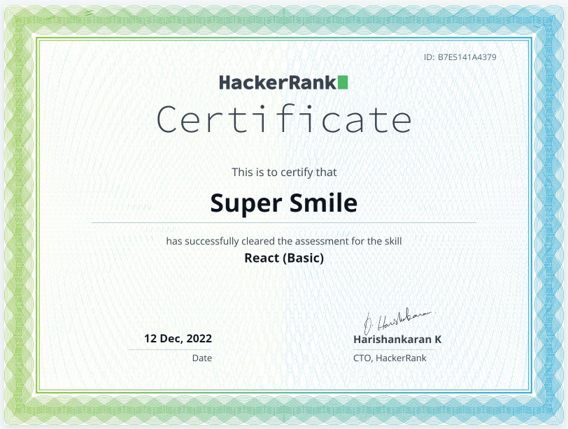
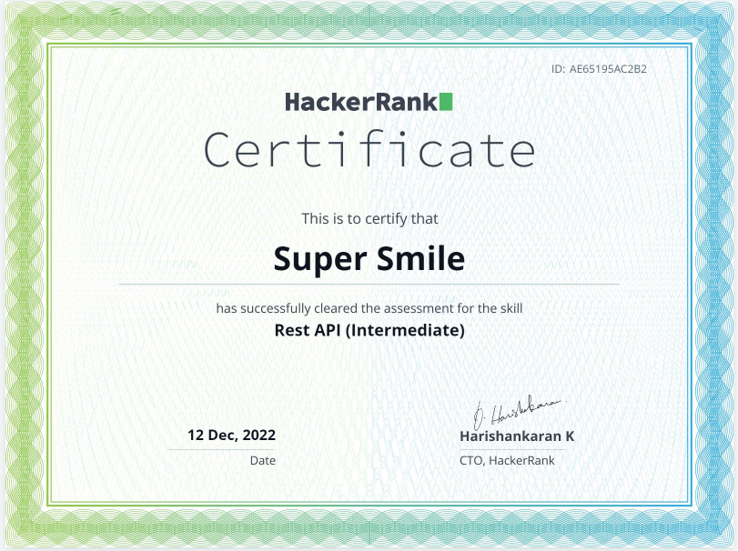
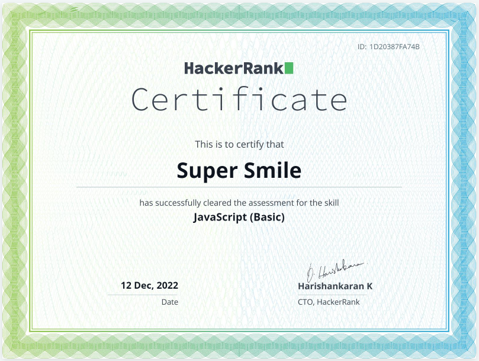
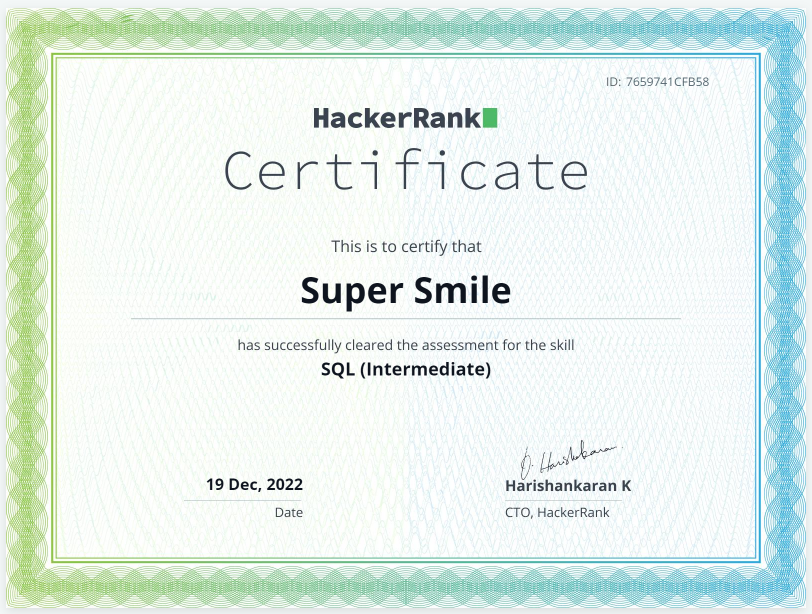
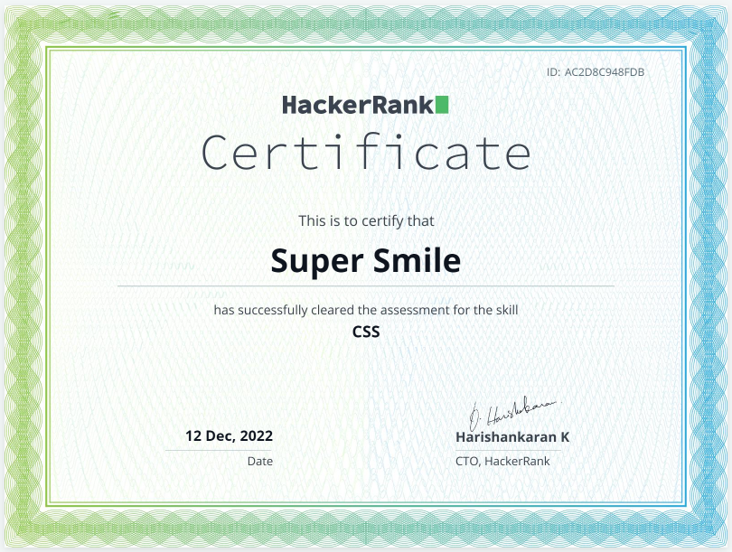

<meta name="awesome-portfolio"/>
<meta title="awesome-portfolio"/>
<meta description="awesome-portfolio"/>

<meta name="portfolio"/>
<meta name="github"/>
<meta name="full-stack"/>

<h1 align="center">
  Seasoned Full Stack Developer.</h1>

  

  
  
   
  

  
  
  
  

<!-- 

  

    

 -->
  
<h2 align="left" id="macropower-tech">Favorite Tech</h2>

> Programming languages.

    
  
    
        

  

> Frontend frameworks and libraries

        
    
    
        
    
    
    
   
    
> Backend frameworks 

    
    
    
        
        
          
        

> Databases and cloud hosting.

    
    
    
    
    
    
    
    
        

> Software and tools.

    
    
    
    
    
    
    
    
    

 

<!-- https://github.com/Ileriayo/markdown-badges -->
  
    
    
